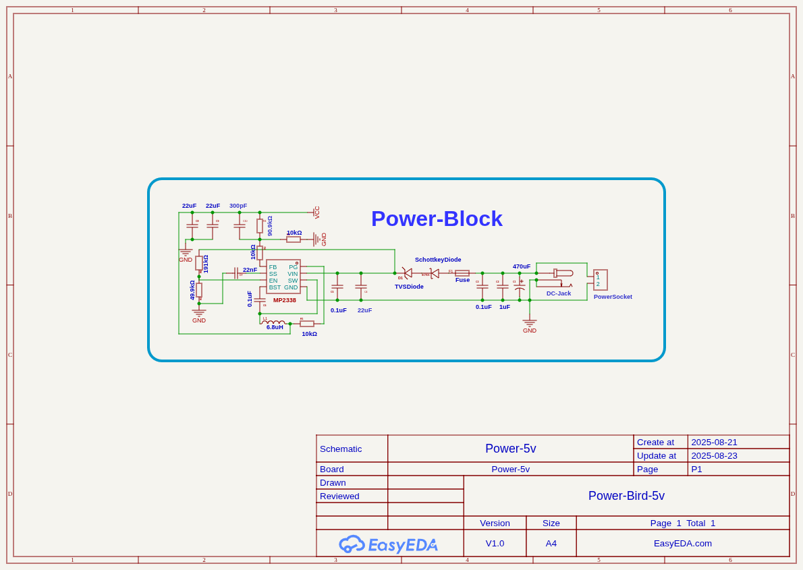
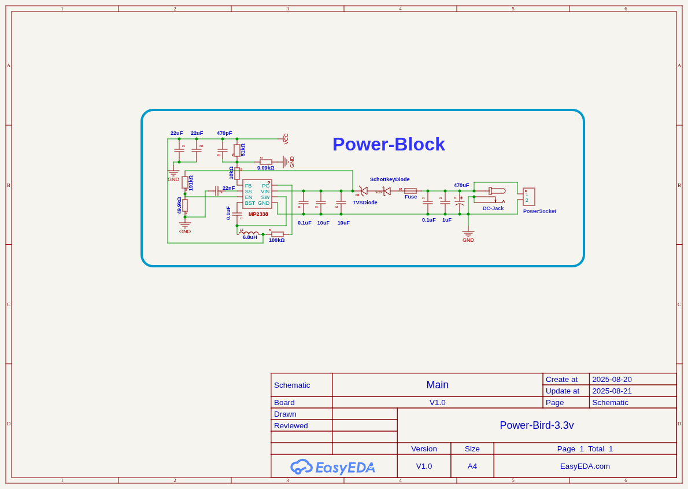

# Power Bird

## ℹ️ Info  
This project is a **high efficiency DC voltage step-down (buck) converter** designed around the **MP2338 IC**. It provides a **regulated 3.3V output** from a wide input voltage range of **5V to 28V**, making it suitable for powering microcontrollers, sensors, and low-voltage digital systems from higher voltage sources such as batteries, adapters, or power supply rails.  

The design focuses on **compactness, efficiency, and reliability**, ensuring stable performance for embedded and power electronics applications.  

---

## ✨ Features  
- **Input Voltage Range:** 5V – 28V  
- **Output Voltage:** Fixed 3.3V regulated  
- **Output Current:** Up to 3A (depending on thermal management and input conditions)  
- **Efficiency:** >90% (typical, depending on load and input voltage)  
- **Switching Frequency:** 500 kHz (internal to MP2338)  
- **Integrated High-Side MOSFET** for compact design  
- **Built-in Protection:**  
  - Overcurrent protection (OCP)  
  - Thermal shutdown (OTP)  
  - Short-circuit protection  
- **Compact PCB footprint** for easy integration into custom projects  

---
## Images :
3.3v

5v

## 🔧 Components  
- **MP2338** – Main buck converter IC  
- **Inductor (4.7 µH – 6.8 µH)** – For energy storage and regulation  
- **Input Capacitors (e.g., 22 µF MLCC)** – To stabilize supply and reduce noise  
- **Output Capacitors (e.g., 22 µF MLCC)** – For ripple reduction and stable output  
- **Schottky Diode (optional, for additional protection)**  
- **Resistors/Feedback Network** – For setting 3.3V output (if not fixed variant)  
- **PCB** – Custom layout optimized for high efficiency and low EMI  
